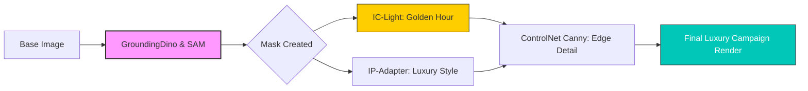

# Sugandh Co. | Luxury Fragrance Concept 🌿
**Where Fragrance Becomes Memory**

Sugandh Co. is a modern Indian luxury fragrance house that blends ancient scent traditions with contemporary design. This project serves as a case study in **Applied GenAI for Brand Strategy and Visual Production.**

---

## 📖 The Brand Story
Sugandh Co. treats perfume not as an accessory, but as a **sensory heirloom**. Inspired by India’s deep relationship with fragrance—from temple rituals to personal adornment—the brand stands for "quiet luxury" where heritage meets restraint.

## 🎨 Campaign Strategy: "Where Fragrance Becomes Memory"
The visuals draw from Indian sensory culture to evoke ritual and intimacy.
- **Narrative:** Perfume as a bridge between past and present.
- **Visual Cues:** Moss, stone, saffron, and golden-hour tones.
- **Aesthetic:** Minimalist, cinematic, and emotionally resonant.

## ⚙️ Technical Execution (The AI Stack)
This project was conceptualized and executed using advanced GenAI node-based architectures to maintain brand consistency:

- **Dynamic Lighting Control:** Implemented **IC-Light (Imposing Consistent Light)** nodes to achieve professional-grade cinematic lighting and "Golden Hour" warmth across different product environments.
- **Style & Texture Mapping:** Utilized **IP-Adapter** for precise style transfer, ensuring the "Sacred Calm" aesthetic remained consistent while blending Indian heritage cues with modern luxury.
- **Intelligent Segmentation:** Integrated **GroundingDino & SAM (Segment Anything Model)** to isolate the perfume bottle, allowing for high-end product-hero shots with a clutter-free, isolated focus.
- **Post-Production:** Upscaled and refined for an editorial, high-end finish.

### Workflow Architecture

## 📁 Project Structure
- [**/final-visuals**](./final-visuals): High-fidelity campaign renders and product-hero shots.
- [**/workflows**](./workflows): The [Sugandha.json](./workflows/Sugandha.json) ComfyUI node architecture used for IC-Light and IP-Adapter control.

---

## 📊 Outcomes & Skills
- **Brand Vision:** Built a cohesive luxury identity from scratch.
- **Technical Translation:** Converted cultural cues into specific AI prompts and parameters.
- **Product Direction:** Created globally competitive luxury aesthetics without traditional lifestyle photography.
